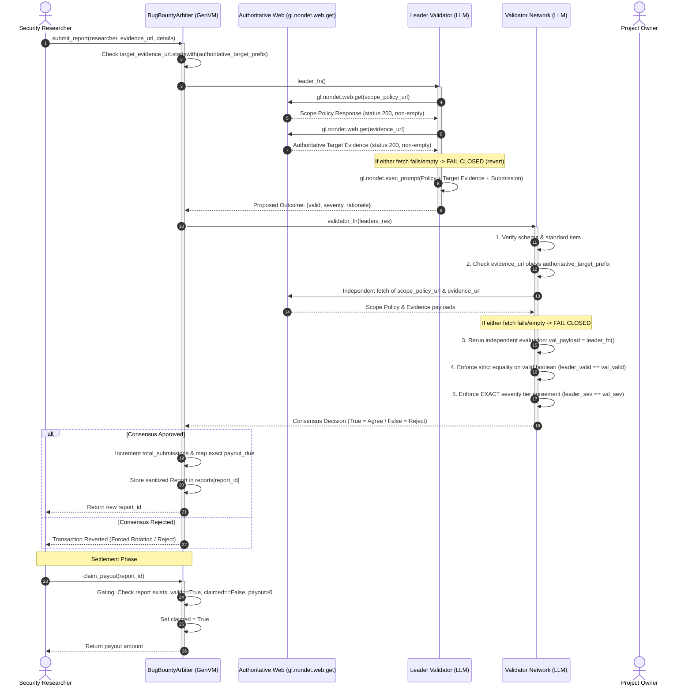

# Autonomous Bug Bounty Triage & Severity Arbiter (`BugBountyArbiter`)

[](https://genlayer.com)
[](https://github.com/genlayerlabs/genvm)
[](https://www.python.org/)
[](tests/test_bounty_arbiter.py)
[](LICENSE)

A decentralized, autonomous Web3 security coordination primitive built for **GenLayer**. `BugBountyArbiter` automates vulnerability report intake, authoritative domain gating, dual-fetch fail-closed multi-validator AI triage, exact severity consensus arbitration, and on-chain payout settlement while maintaining strict state hygiene.

---

## 1. Overview & Problem Statement

In traditional Web2 and Web3 bug bounty programs (e.g. Immunefi, HackerOne), the vulnerability disclosure lifecycle depends entirely on centralized intermediaries or off-chain team multisigs:

- **Centralized Triage Bottlenecks**: Human triage queues take days or weeks, introducing communication lag and human error.
- **Subjective Disputes & Conflict of Interest**: Project teams often attempt to downgrade severity tiers (e.g. downgrading a Critical exploit to Low) to minimize payout liabilities.
- **Counterparty & Escrow Risk**: Security researchers must trust that a project team will honor their published policy and disburse rewards after private disclosure has already occurred.
- **Subjective Narrative Risk**: Relying purely on an arbitrary submitter's narrative without independently acquired target source code or verifiable proof risks approving phantom claims or hallucinated payouts.

### How `BugBountyArbiter` Solves This

`BugBountyArbiter` implements a robust, fail-closed on-chain adjudication protocol:
1. **Authoritative Domain Boundary Gating**: The contract defines an immutable or owner-managed `authoritative_target_prefix` (e.g. `https://raw.githubusercontent.com/JimmyOgb/bug-bounty-arbiter/`). Every submitted report MUST provide a `target_evidence_url` within this boundary. Submissions pointing to caller-controlled external sites or arbitrary URLs are rejected immediately before consensus.
2. **Dual-Fetch Fail-Closed Acquisition**: Inside consensus, both leader and validators MUST successfully fetch both the authoritative scope policy AND the authoritative target source/evidence via `gl.nondet.web.get`. If either URL fails (HTTP non-200, empty body, or connection error), the contract **fails closed** immediately (`gl.vm.UserError`). Under NO circumstance can LLM adjudication proceed or payout liability be recorded without live, authoritative ground truth.
3. **Decentralized Multi-Validator Consensus**: GenLayer validators independently triage the vulnerability against the retrieved policy and target evidence using GenVM's native LLM capabilities (`gl.nondet.exec_prompt`).
4. **Strict Severity Equivalence (Exact Binding)**: Because severity tier directly indexes into `payout_table` (`payout_due`), validators MUST independently agree on the **exact severity tier** (`LOW`, `MEDIUM`, `HIGH`, `CRITICAL`, `NONE`) and the exact `valid` boolean. Adjacent tier drift is strictly rejected.
5. **Guaranteed On-Chain Settlement**: Once consensus finalizes an exact valid finding, bounty payouts are locked and claimable directly via contract execution, eliminating human dispute mediation.

---

## 2. Architecture & State Hygiene

A fundamental tenet of GenLayer intelligent contract design is balancing off-chain non-deterministic compute with lightweight on-chain state.

```
┌────────────────────────────────────────────────────────────────────────┐
│               Ephemeral Non-Deterministic Execution                    │
│   (Leader & Validator memory only — NEVER persisted on-chain)          │
│                                                                        │
│  - Full vulnerability details & exploit reproduction steps             │
│  - Authoritative target code & scope policy text fetched via web       │
│  - Raw LLM prompt inputs & complete chain-of-thought analysis          │
│  - Candidate JSON payload proposals                                    │
└──────────────────────────────────┬─────────────────────────────────────┘
                                   │ gl.vm.run_nondet
                                   │ Consensus Finalization
                                   ▼
┌────────────────────────────────────────────────────────────────────────┐
│                     Permanent On-Chain Storage                         │
│                    (TreeMap[u256, Report])                             │
│                                                                        │
│  - id: u256                   - severity: str ("HIGH")                 │
│  - researcher: str            - rationale: str (truncated summary)     │
│  - target_evidence_url: str   - payout_due: u256                       │
│  - valid: bool                - claimed: bool                          │
└────────────────────────────────────────────────────────────────────────┘
```

### Key State Hygiene Rules
- **Zero Exploit Storage**: Raw exploit payloads and vulnerability descriptions (`vulnerability_details`) are **never** stored on-chain. Storing exploit code on a public ledger creates severe state bloat and leaks attack vectors before protocol teams can remediate the underlying codebase.
- **Sanitized Metadata Persistence**: Only the finalized adjudication results are written to `TreeMap[u256, Report]`.
- **Bounded Storage Footprints**: Rationale strings are length-capped (max 280 characters) to prevent unbounded storage bloating.

### Storage Layout

```python
class BugBountyArbiter(gl.Contract):
    project_owner: str               # Authorized administrator address / identity
    scope_policy_url: str            # Canonical URL pointing to scope policy markdown
    authoritative_target_prefix: str # Mandatory prefix defining authoritative domain boundary
    is_active: bool                  # Program intake toggle (True = active, False = paused)
    total_submissions: u256          # Monotonically increasing submission counter
    payout_table: TreeMap[str, u256] # Standard tier reward lookup (NONE, LOW, MEDIUM, HIGH, CRITICAL)
    reports: TreeMap[u256, Report]   # Persisted sanitized report records keyed by report_id
```

### Stored Record Data Model

```python
@allow_storage
@dataclass
class Report:
    id: u256
    researcher: str
    target_evidence_url: str
    valid: bool
    severity: str
    rationale: str
    payout_due: u256
    claimed: bool
```

---

## 3. Consensus & Equivalence Principle Design

Because LLMs generate natural language non-deterministically, standard blockchain equality (`gl.eq_principle.strict_eq`) would fail across validators. Conversely, naive schema-only checks (which merely inspect whether the leader formatted JSON correctly) blindly trust the leader without running independent verification.

`BugBountyArbiter` implements a **Comparative Equivalence Principle** using `gl.vm.run_nondet(leader_fn, validator_fn)` combined with **Dual-Fetch Fail-Closed Web Acquisition**, **Authoritative Domain Boundaries**, and **Strict Severity Equivalence**:

1. **Authority Validation**: Prior to consensus execution and inside validator checks, the contract verifies `target_evidence_url.startswith(self.authoritative_target_prefix)`.
2. **Dual-Fetch Fail-Closed Acquisition**: Inside `leader_fn` and independently inside `validator_fn`:
   - Scope policy is fetched via `gl.nondet.web.get(self.scope_policy_url)`.
   - Target evidence is fetched via `gl.nondet.web.get(target_evidence_url)`.
   - If either request returns non-200 or an empty body, execution reverts with `gl.vm.UserError("Failed to acquire authoritative scope policy or target evidence; failing closed.")`.
3. **Objective LLM Verification**: The evaluation prompt feeds the fetched policy text, the fetched target evidence/code, and the researcher's reproduction steps. The LLM must verify whether the fetched evidence objectively demonstrates the claimed exploit against the fetched policy.
4. **Exact Severity Binding**: Because the severity tier directly indexes into `self.payout_table` (`payout_due`), loose tolerances (such as adjacent severity allowances) are strictly rejected. If `leader_data["severity"] != my_eval["severity"]` or `leader_data["valid"] != my_eval["valid"]`, `validator_fn` returns `False`. Consensus is only achieved when both leader and validator independently arrive at the exact same severity tier and validity decision.

### Sequence Diagram



### Consensus & Equivalence Rule Matrix

| Check | Rule | Failure Consequence |
| :--- | :--- | :--- |
| **Authoritative Prefix Gating** | `target_evidence_url.startswith(authoritative_target_prefix)` | Reverts immediately: `Evidence URL violates authoritative domain boundary`. |
| **Execution State** | `isinstance(leaders_res, gl.vm.Return)` | Returns `False`: Leader crashed or encountered timeout. |
| **Payload Schema** | Dictionary with keys `"valid"`, `"severity"`, `"rationale"` | Returns `False`: Malformed JSON or corrupted return structure. |
| **Standard Tiers** | `leader_sev in {"NONE", "LOW", "MEDIUM", "HIGH", "CRITICAL"}` | Returns `False`: Rejects hallucinated tiers (e.g. `SUPER_CRITICAL`, `FATAL`). |
| **Semantic Coherence** | If `not valid` ➔ `severity == "NONE"`; If `valid` ➔ `severity != "NONE"` | Returns `False`: Rejects self-contradictory proposals. |
| **Dual Web Acquisition** | `policy_res.status == 200` & `evidence_res.status == 200` & bodies non-empty | Reverts transaction: `Failed to acquire authoritative scope policy or target evidence; failing closed.` |
| **Independent Verification** | `val_payload = leader_fn()` | Returns `False`: Validator independently executes web retrieval and LLM prompt. |
| **Strict Validity Equality** | `leader_valid == val_valid` | Returns `False`: **Zero tolerance for validity disputes**. Both must agree report is valid. |
| **Exact Severity Equivalence** | `leader_sev == val_sev` | Returns `False`: **Zero tolerance for severity mismatches**. Adjacent tiers rejected to bind exact payout. |

---

## 4. Contract Interface

The contract exposes 8 public methods (2 view methods and 6 write methods):

### Constructor

```python
def __init__(
    project_owner: str,
    scope_policy_url: str,
    authoritative_target_prefix: str,
)
```
- `project_owner`: Administrator address or account string permitted to configure parameters.
- `scope_policy_url`: Public HTTP/HTTPS URL referencing the markdown scope policy (e.g. [SECURITY.md](SECURITY.md)).
- `authoritative_target_prefix`: Strict URL prefix defining the authoritative domain boundary for reproducible proof or source code.

### Methods

| Method | Type | Parameters | Returns | Description |
| :--- | :--- | :--- | :--- | :--- |
| `submit_report` | Write | `researcher: str`, `target_evidence_url: str`, `vulnerability_details: str` | `int` (report ID) | Ingests a report after validating that `target_evidence_url` matches `authoritative_target_prefix`. Fetches live policy & evidence, fails closed on any fetch failure, runs multi-validator LLM triage, and enforces exact severity equivalence. |
| `claim_payout` | Write | `report_id: int` | `int` (payout amount) | Authorizes and claims payout for a verified valid report. Strictly gated against double-claims and invalid reports. |
| `get_report` | View | `report_id: int` | `dict` | Returns on-chain metadata for a submission (`id`, `researcher`, `target_evidence_url`, `valid`, `severity`, `rationale`, `payout_due`, `claimed`). |
| `get_program_status`| View | _None_ | `dict` | Returns program health: `project_owner`, `scope_policy_url`, `authoritative_target_prefix`, `is_active`, `total_submissions`, and full `payout_table`. |
| `set_active` | Write | `is_active: bool` | `None` | (Admin-only) Toggles bounty program intake (allows pausing/unpausing submissions). |
| `update_payout` | Write | `severity: str`, `amount: int` | `None` | (Admin-only) Updates payout amounts for a standard severity tier (`LOW`, `MEDIUM`, `HIGH`, `CRITICAL`). |
| `update_scope_policy` | Write | `new_scope_url: str` | `None` | (Admin-only) Updates the referenced scope policy document URL. |
| `update_authoritative_target_prefix` | Write | `new_prefix: str` | `None` | (Admin-only) Updates the authoritative target domain boundary prefix. |

---

## 5. Local Development & Testing Guide

### Prerequisites
- Python 3.11 or 3.12
- `genvm-linter` (`pip install genvm-linter`)
- `genlayer-test` (`pip install genlayer-test pytest`)

### 1. Contract Linter Check
Validate SDK compliance, type annotations, storage rules, and AST safety:

```powershell
# Windows PowerShell
$env:PYTHONIOENCODING="utf-8"; genvm-lint check contracts/bounty_arbiter.py
```

Expected output:
```text
✓ Lint passed (3 checks)
✓ Validation passed
  Contract: BugBountyArbiter
  Methods: 8 (2 view, 6 write)
```

### 2. Run Test Suite
Run the comprehensive test suite with pytest:

```bash
pytest -v tests/test_bounty_arbiter.py
```

### Test Suite Breakdown (28/28 Passing)
```text
tests/test_bounty_arbiter.py::test_initialization_and_program_status PASSED      [  3%]
tests/test_bounty_arbiter.py::test_initialization_empty_owner_reverts PASSED     [  7%]
tests/test_bounty_arbiter.py::test_initialization_empty_policy_url_reverts PASSED [ 10%]
tests/test_bounty_arbiter.py::test_initialization_empty_target_prefix_reverts PASSED [ 14%]
tests/test_bounty_arbiter.py::test_evidence_url_authority_boundary_validation PASSED [ 17%]
tests/test_bounty_arbiter.py::test_submit_report_valid_critical PASSED           [ 21%]
tests/test_bounty_arbiter.py::test_submit_report_valid_tiers PASSED              [ 25%]
tests/test_bounty_arbiter.py::test_submit_report_invalid_creates_no_payout_liability PASSED [ 28%]
tests/test_bounty_arbiter.py::test_fail_closed_policy_fetch_http_error PASSED   [ 32%]
tests/test_bounty_arbiter.py::test_fail_closed_policy_fetch_empty_body PASSED   [ 35%]
tests/test_bounty_arbiter.py::test_fail_closed_evidence_fetch_http_error PASSED [ 39%]
tests/test_bounty_arbiter.py::test_fail_closed_evidence_fetch_empty_body PASSED [ 42%]
tests/test_bounty_arbiter.py::test_fail_closed_missing_mock_or_network_failure PASSED [ 46%]
tests/test_bounty_arbiter.py::test_authoritative_evidence_and_policy_injected_into_prompt PASSED [ 50%]
tests/test_bounty_arbiter.py::test_validator_rejection_validity_disagreement PASSED [ 53%]
tests/test_bounty_arbiter.py::test_validator_rejection_adjacent_severity_mismatch PASSED [ 57%]
tests/test_bounty_arbiter.py::test_validator_rejection_major_severity_divergence PASSED [ 60%]
tests/test_bounty_arbiter.py::test_validator_acceptance_exact_severity_match PASSED [ 64%]
tests/test_bounty_arbiter.py::test_validator_rejection_hallucinated_severity_tier PASSED [ 67%]
tests/test_bounty_arbiter.py::test_validator_rejection_semantic_contradiction PASSED [ 71%]
tests/test_bounty_arbiter.py::test_validator_rejection_malformed_schema PASSED [ 75%]
tests/test_bounty_arbiter.py::test_claim_payout_flow PASSED                      [ 78%]
tests/test_bounty_arbiter.py::test_claim_payout_gating_double_claim_reverts PASSED [ 82%]
tests/test_bounty_arbiter.py::test_claim_payout_gating_invalid_report_reverts PASSED [ 85%]
tests/test_bounty_arbiter.py::test_claim_payout_nonexistent_report_reverts PASSED [ 89%]
tests/test_bounty_arbiter.py::test_submit_report_when_program_inactive_reverts PASSED [ 92%]
tests/test_bounty_arbiter.py::test_submit_report_input_validation PASSED         [ 96%]
tests/test_bounty_arbiter.py::test_administrative_methods_and_access_control PASSED [100%]

============================= 28 passed in 58.92s =============================
```

---

## 6. Deployment & Interaction

### Deploying via GenLayer CLI
```bash
# Start local node
genlayer up

# Deploy BugBountyArbiter with owner, policy URL, and authoritative target prefix
genlayer deploy contracts/bounty_arbiter.py \
  --args '["0x2bd806c97F0e00aF1a1fC3328fA763a9269723C8", "https://raw.githubusercontent.com/JimmyOgb/bug-bounty-arbiter/main/SECURITY.md", "https://raw.githubusercontent.com/JimmyOgb/bug-bounty-arbiter/"]' \
  --network localnet
```

### Deploying via GenLayer Studio
1. Open [GenLayer Studio](https://studio.genlayer.com).
2. Load [`contracts/bounty_arbiter.py`](contracts/bounty_arbiter.py).
3. Specify constructor arguments:
   - `project_owner`: `0x2bd806c97F0e00aF1a1fC3328fA763a9269723C8`
   - `scope_policy_url`: `https://raw.githubusercontent.com/JimmyOgb/bug-bounty-arbiter/main/SECURITY.md`
   - `authoritative_target_prefix`: `https://raw.githubusercontent.com/JimmyOgb/bug-bounty-arbiter/`
4. Click **Deploy**. Use the interactive console to test report triage, view stored metadata, and test payout claims.

---

## 7. Security Policy

Refer to [`SECURITY.md`](SECURITY.md) for full program scope guidelines and component definitions.

---

## 8. License

This project is open-source software licensed under the [MIT License](LICENSE).
